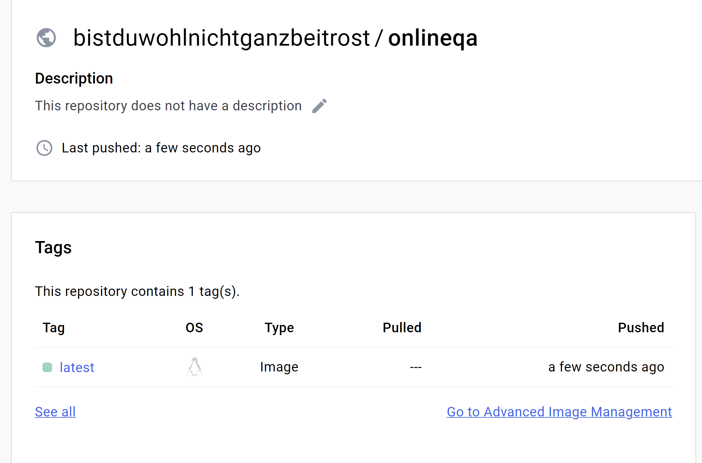
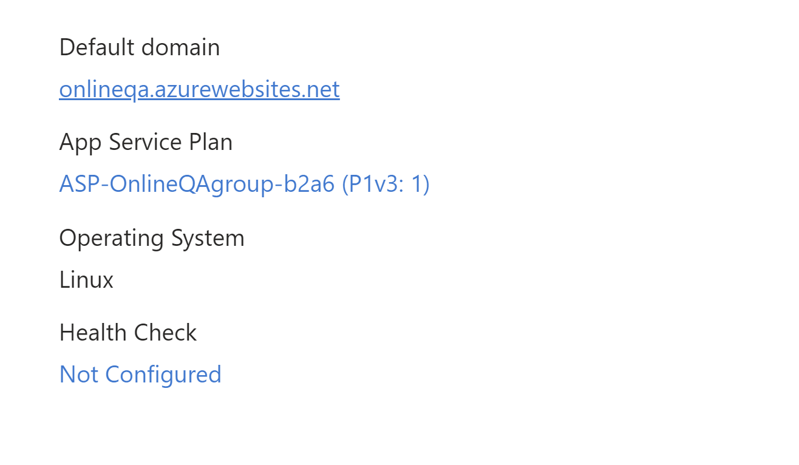
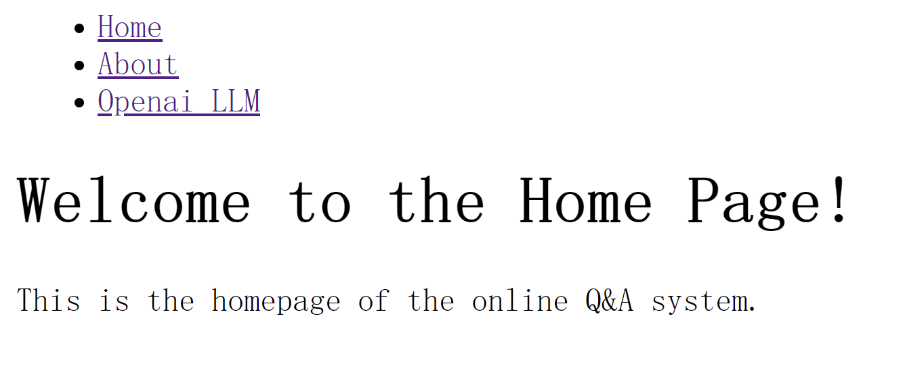
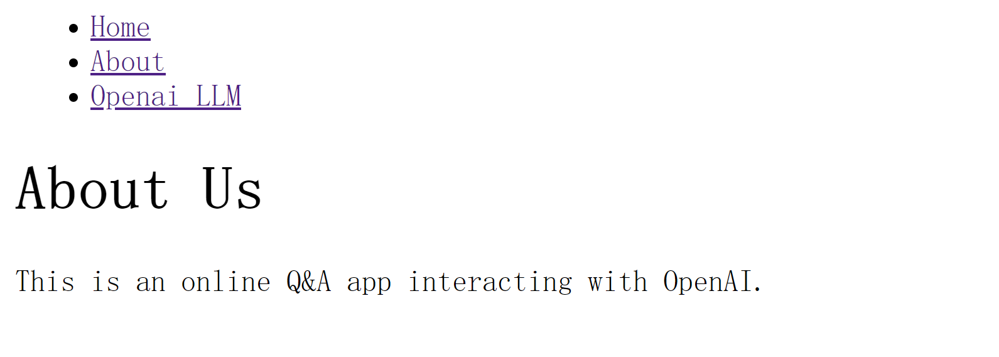
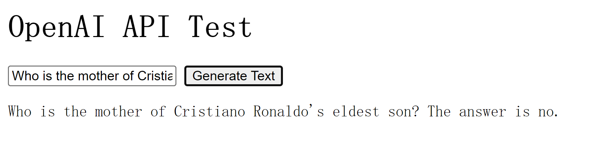

# 706_Project4_YL

This repository includes the main tasks for Project 4:

* `Makefile` is a configuration file used in Unix-based systems for automating tasks and building software. It contains instructions and dependencies for compiling code, running tests, and other development tasks.
* `.devcontainer` includes a Dockerfile and `devcontainer.json`. The `Dockerfile` within this folder specifies how the container should be built, and other settings in this directory may control development environment configurations.
* `Workflows` includes GitHub Actions, which contain configuration files for setting up automated build, test, and deployment pipelines for your project.
* `.gitignore` is used to specify which files or directories should be excluded from version control when using Git.
* `README.md` is the instruction file for the readers.
* `app.py` is a Flask app that can be deployed on Azure App.
* `Dockerfile` defines the process of the Docker container.
* `main.py` and `test_main.py` are sample files to function the CI/CD pipeline.
* `requirements.txt` is to specify the dependencies (libraries and packages) required to run the project.

## Project description

* Distroless AWS Lambda: Your project should effectively use Distroless
AWS Lambda functions for data processing. This involves including a
Dockerfile that uses the Distroless container format. Distroless containers
contain only your application and its runtime dependencies. They do not
contain package managers, shells or any other programs in a standard
Linux distribution.
* AWS Step Functions: Include AWS Step Functions to orchestrate your
data pipeline.
* Infrastructure as Code (IaC): Use an IaC solution such as AWS
CloudFormation, AWS SAM, or AWS CDK for provisioning and managing
your AWS resources. The deployment process should be set up as
"continuous delivery," meaning it is automatically deployed on changes
either through GitHub Actions or AWS CodeBuild.

## Project environment

* Use codespace for scripting
* Container built in `devcontainers` and virtual environment activated via `requirements.txt`
* To run the app, use the command `python app.py` in the terminal

## Local deployment

First, write a Dockerfile in the root repository.

Install Docker Desktop on the local machine, and run the followings:

1. Clone the repository: `git clone https://github.com/nogibjj/706_Project4_YL.git`

2. Move to the directory where the Dockerfile locates: `cd 706_Project4_YL`

3. Build the Docker image: `docker build -t onlineqa:latest .`

4. Run the Docker container: `docker run -p 23333:23333 onlineqa:latest`

## DockerHub login and Push

`docker login --username=bistduwohlnichtganzbeitrost`

`docker build -t bistduwohlnichtganzbeitrost/onlineqa`

`docker push bistduwohlnichtganzbeitrost/onlineqa`

## Azure deployment

1. Create Web App on Azure with settings on Docker Image:

2. Add and set `WEBSITES_PORT=23333` on Azure:

3. Check deployed information on Azure App Services:

## Webpage Review

Website: https://onlineqa.azurewebsites.net/

I designed a home page, an about page, and a API test page for the app:

## Video link

https://www.youtube.com/watch?v=4a2z2xOnXjI

## Reference

https://portal.azure.com/#@noahgiftgmail.onmicrosoft.com/resource/subscriptions/ad5ba8f3-b778-4b9d-9245-f43b213d40d7/resourcegroups/OnlineQA_group/providers/Microsoft.Web/sites/OnlineQA/appServices
